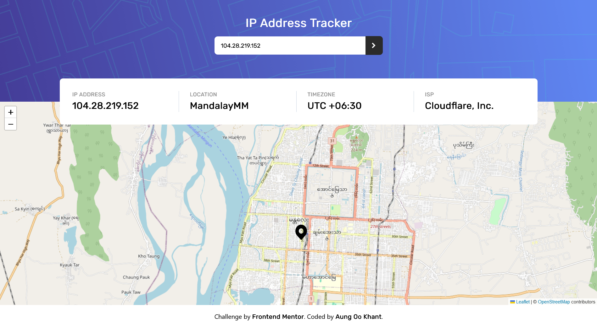

# Frontend Mentor - IP address tracker solution

This is a solution to the [IP address tracker challenge on Frontend Mentor](https://www.frontendmentor.io/challenges/ip-address-tracker-I8-0yYAH0). Frontend Mentor challenges help you improve your coding skills by building realistic projects. 

## Table of contents

- [Overview](#overview)
  - [The challenge](#the-challenge)
  - [Screenshot](#screenshot)
  - [Links](#links)
- [My process](#my-process)
  - [Built with](#built-with)
  - [What I learned](#what-i-learned)
  - [Continued development](#continued-development)
  - [Useful resources](#useful-resources)
- [Author](#author)

## Overview

### The challenge

Users should be able to:

- View the optimal layout for each page depending on their device's screen size
- See hover states for all interactive elements on the page
- See their own IP address on the map on the initial page load
- Search for any IP addresses or domains and see the key information and location

### Screenshot

### Links

- Solution URL: [Add solution URL here](https://your-solution-url.com)
- Live Site URL: [Add live site URL here](https://your-live-site-url.com)

## My process
I first did the top part: the input field first. And then I did the map. And then I did the middle part where the informations were shown. And lastly I made it responsive. 

### Built with

- tailwind css
- Mobile-first workflow
- [React](https://reactjs.org/) - JS library

### What I learned

This was suprisingly challenging. And I learnt new things as well. Now I know how to add maps to my react apps. I now have a better understanding of react hooks, specifically useEffect. I can now make API requests comfortably. Pretty dope project overall.

### Continued development

Still need to learn more about other react hooks. And I think it's time to learn typescript.

### Useful resources

- [ipify](https://www.ipify.org) - I used this website to get the ip address of the user. It's pretty simple and I think I'll use this every times I need to get the ip address.
- [useEffect Hook](https://www.youtube.com/watch?v=0ZJgIjIuY7U&list=PLZlA0Gpn_vH8EtggFGERCwMY5u5hOjf-h&index=2&pp=iAQB) - This video finally made me understand how useEffect hook works. Pretty good video. I would recommend to anyone who wants to learn about useEffect.

## Author

- Website - [Aung Oo Khant](https://aungookhant-portfolio.onrender.com/)
- Frontend Mentor - [@aok207](https://www.frontendmentor.io/profile/aok207)
- Twitter - [Aung OO Khant](https://www.facebook.com/aungookhant.aung)
